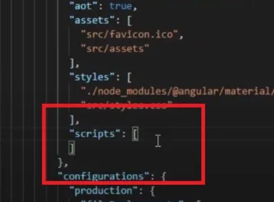
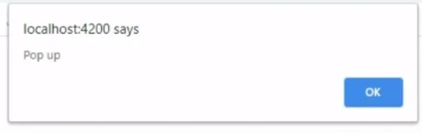

#### In this article we learn how to Add, Load, and Use JavaScript in Angular(components).
##### [Method-1: Using angular.json to load Js files in angular project]
1. Firstly we need to place whatever JS files we need in the assets folder of Angular Project.
2. Next open angular.json file and add the js file address in scripts array as shown below:
.
3. Also Remember to change the backward slashes into forward slashes.
Ex:
```json
"scripts": [
   "src/assets/ExampleJS1.js"
]
```
4. Now there should be some code inside the js for it to work.
Ex:
```javascript
function greet(){
   alert("Hello");
}
alert("Pop up");
```
5. And after running our angulr app it will display as below:
.

##### [Method - 2: Reusing JS file code(variables,methods etc) in Angular components]
1. Now let's suppose you want to use the functions or variables in the JavaScript files.
2. Then to do so declare a reference in the  TypeScript file by using **declare keyword** and then the variable or function you want to reference as shown below:

```typescript
import { Component } from '..'

declare function greet(): void; // like this.

@Component({
   ....
})

export class AppCompoent {
}
```
3. Then after declaring the reference call the reference method in constructor of angular component as shown below:
```typescript
import { Component } from '..'

declare function greet(): void;

@Component({
....
})

export class AppCompoent {
   constructor(){
      greet();
   }
}
```
##### [Method - 3: Using Links]
1. The best and easy method is to just use links of the js files in index.html of your angular project.
Ex:
```html
<!doctype html>
<html lang="en">
<head>
</head>
<body>
<app-root></app-root>
   <script src="https://someapi.com/where-your-js-reside"></script>
</body>
</html>
```
> Remember to put your JS CDN links always at the bottom of the body closing tag, as it is a best practice.

- Q. Note:We often hear to use JS links just above the body closing tag ever wondered Why?
- A. It is Because html+css should load first then js should change the dom. If you add JS CDN link similar to css CDN links in the head section of index.html then you might face unexpected behaviour of your website due to js loading and already changing the DOM even before the html and css has loaded properly.

2. All this using of JS is good and all but if you are an beginner to intermediate level angular developer then you might face a situation where you needed to use JS in your angular component(specifically).
- Even though we try to convert that js code to ts and use it in a method it is a bit weird and not always works the same.
- So to over come the above issue we have an approach #4.

##### [Method - 4: Using JS files in angular component at runtime(dynamically)]
- To use the js code in angular component you have to do that manually by creating a **script element object**.
- Then set the value of the src property to the path of the JavaScript file you want to load.
- This can be a URL or a local path in the project.
- Lastly, add the script element to the body of the HTML page as shown below:
```Typescript
import { Component } from '@angular/core'

@Component({
   ....
})

export class AppComponent {

myScriptElement: HTMLScriptElement; //this is used to create the type definition of the script-element-object.
   
   constructor(){
      this.myScriptElement = document.createElement("script"); // this is used to create the script element.
      this.myScriptElement.src = "....."; // Here you provide the addresss link of the JS file stored in assets folder.
      document.body.appendChild(this.myScriptElement); // Using appendChild you insert/inject the script element in to the DOM.
   }
}
```
>Note: I have used method#4 to use swiperjs in my angular v15 project via external swiper.js file. 
And I can say this works on most of angular versions.